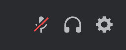
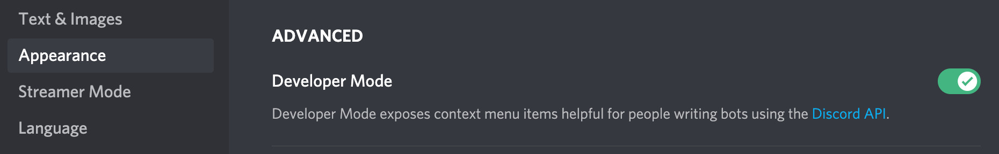
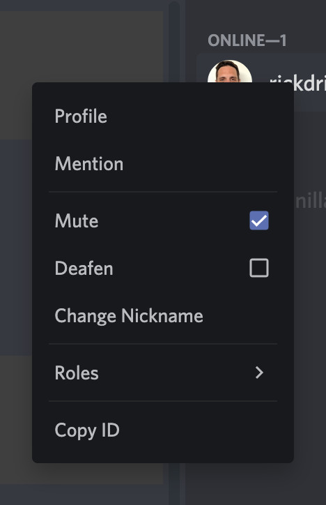
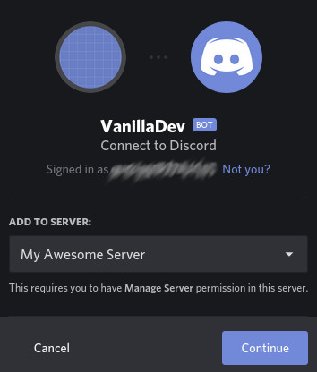
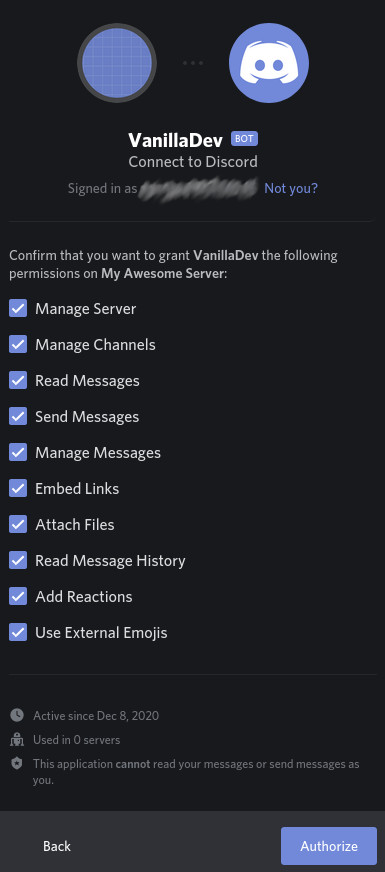
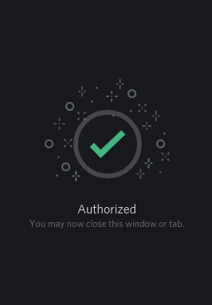

# Contributing

Follow this guide if you wish to help with the development of this community project.

## Purpose

The main goal of this project is to encourage our community members to participate in the development to learn something new, to contribute to the community, or just to getting started with open source.

This bot was kicked off to meet the needs of our community, but we thought on the long run that other communities may benefit from our project as well. We decided then to develop it in a more flexible way.

Any community on Discord could use a little help managing the day to day activities and delivering to its user the best possible experience.

There's a lot of bots available out there, but carelessly adding bots to gather all the features we like might be cumbersome and add too much overhead.

This project aims to reduce this overhead developing a bot for the community and with the community.

## Get ready

To contribute to the code you'll need to:

- Setup your local machine
- Create for free a Discord developer account
- Get a token for your development bot
- Create a Discord server, for testing purposes
- Invite the bot to your server

All of this will be explained step-by-step.

## Local machine setup

If you made this far you most likely know the drill:

1. Install the latest [Node.js](https://nodejs.org/en/) LTS (using [nvm](https://github.com/nvm-sh/nvm) or similar library is highly recommended).

1. Clone this repository

1. Execute `npm install`

## Discord developer account (free)

Here's a walkthrough to get up and running with Discord:

1. Sign up or login to [Discord Developer Portal](https://discord.com/developers/applications), you can also use the QR code provided for logging in via mobile app.
   

1. In the dashboard, click _New Application_ on the top right.
   

1. Specify a name for your application (e.g. VanillaDev) and click _Create_.
   

1. This is how your app overview looks like, **do not share client secret** under any circumstance.
   

1. Navigate to the _Bot_ section, then click _Add Bot_.
   

1. This is how your bot overview looks like, **do not share token** under any circumstance.
   

For further information please refer to the [official Discord documentation](https://discord.com/developers/docs/intro).

## Getting your bot token

For local development you need to provide your bot token as follows:

1. Open your browser.

1. Navigate to your dashboard on [Discord Developer Portal](https://discord.com/developers/applications/).

1. Select the application you created.

1. Navigate to the _Bot_ section.

1. Click _Copy_ underneath _TOKEN_.  
   

1. Open your IDE or editor of choice (e.g. [Visual Studio Code](https://code.visualstudio.com/)).

1. Open the folder where you cloned this repository.

1. In the root folder, rename the file called `.env-example` to `.env`.

1. Open the file `.env`.

1. Paste the token you copied on `PASTE_HERE_YOUR_TOKEN`, be careful to leave **no blank spaces**.

## Getting your user ID

1. Open Discord client.

1. Click on the ⚙️ icon in the bottom left.  
   

1. Click on _Appearance_, then scroll down and enable _Developer Mode_.  
   

1. Go to any server you joined and find your avatar on the user list on the right.

1. Right click on your avatar, then click _Copy ID_ to copy your user ID.  
   

1. Open your IDE or editor of choice.

1. Open the folder where you cloned this repository.

1. Open the file `.env`.

1. Paste the user ID you copied on `PASTE_HERE_YOUR_OWNER_ID`, be careful to leave **no blank spaces**.

## Discord server creation

You need a Discord server to test your bot. To create one follow these steps:

1. Open your Discord client.

1. Click the `+` icon in the bottom left.

1. Click the option _Create My Own_.  
   

1. Customize your server adding a name and optionally an icon.  
   

## Bot invitation

A Discord bot is like a special user that needs to be invited to your server with a specific set of permissions, depending on the bot functionalities.

Here's a walkthrough:

1. Open your browser.

1. Navigate to your dashboard on [Discord Developer Portal](https://discord.com/developers/applications/).

1. Select the application you created.

1. Navigate to the section _OAuth2_.

1. Click _Copy_ underneath _CLIENT ID_.

1. Navigate to [Discord Permissions Calculator](https://discordapi.com/permissions.html#388208), to facilitate this link has already been set with the correct permissions for this project.  
   

1. Paste the Client ID you copied in the proper field.

1. Click the link.

1. In the new page you'll be prompted to login to Discord.

1. Select via dropdown the server you want to add your bot to and click _Continue_.  
   

1. You'll see a summary of the permissions, click _Authorize_.  
   

1. Complete the reCaptcha to proceed.

1. You'll be shown a success message.  
   

Checking your server on Discord client your bot appears now as an offline user.

It's time to bring your bot online.

## Bringing your bot online

To bring your bot online for development:

1. Open a terminal.

1. Navigate to the folder where you cloned this repository.

1. Execute `npm run dev`.

Your bot appears now as an online user and you can interact with it.

Congratulations!
